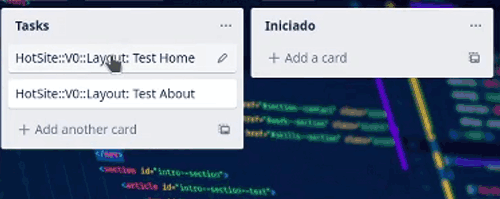
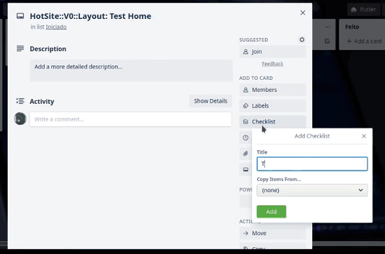
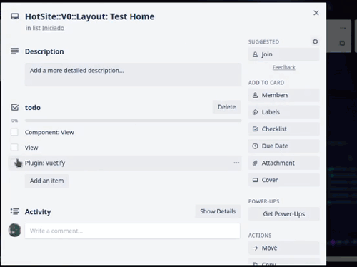
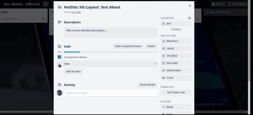

# Scrum pra nois

OBS: dinamica basica baseada em scrum para desenvolvido de um trabalho de faculdade... isso não reflete a pratica real que seria do scrum aplicado em uma empresa/startup.

## Começando

### >>> SPRINT BACKLOG

Onde fica os componentes a serem desenvolvidos.  

cada card tem um checklist do que sera criado em 'Tasks'  

### >>> TASKS

Onde ficam os itens da checklist de 'Sprint Backlog'  

#### Nomeclatura

+ Nome (Alias) da task em 'Sprint Backlog'
+ Versão (Opcional)
+ Nome da 'funcionalidade'
<!-- + Nome do Dev. que pegou a 'task' -->

### >>> INICIADO

Uma task iniciada por um dev... Aqui o dev. ira começar a desenvolver a funcionalidade prevista na sprint, podendo mudar a 'composicao' da mesma colocando 'checklist' para modularizar o desenvolvimento da 'funcionalidade'  

#### Checklists - Regras

Uma task pode ser dividida em varios fragmentos caso seja necessario, porem, uma task desse tipo so pode ser movida para 'Feito' se todos os seus checklists forem compridos, caso contrario, se o Dev. que pegou der por encerrado seu 'expediente' devera mover o card para 'Pendente'.  

### >>> PENDENTE

Aqui ficara a task que o dev. pegou e precisou parar de 'codar' ou queira iniciar uma outra task sem encerrar a task atual que pegou.  

Neste momento, é indicado que seja mandando para o repositorio a branch no qual a 'task' ia ser implementada, podendo outro dev. pegar a task para resolver o problema da 'pendencia'...  

É recomendando que o novo dev que ira trabalhar na task pendente informe ao dev. anterior que trabalhou nela.

Também é recomendado que em 'atividades' o dev. que estava trabalhando na task informe qualquer erro de impedimento  

### >>> FEITO

Task terminada, o item da checklist em 'Sprint Backlog' pode ser marcado e outra task podera ser feita pelo dev, não esquecendo de da o push da 'feature' no qual a task representava para poder ser 'margeada' na 'develop'  

